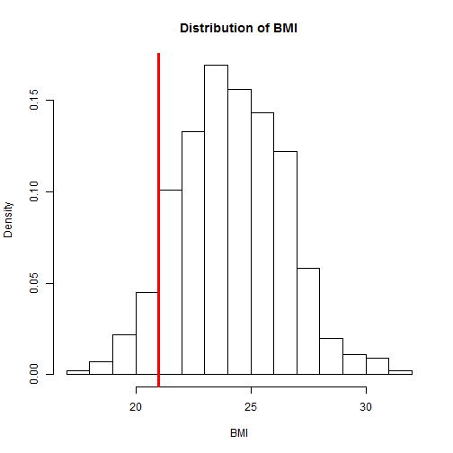

## Introduction

This app was created as part of Coursera Course-Developing Data Products. 
It calculates the BMI index of the visitor based on his input.

Overweight can cause many serious diseases. In order to monitor the weight, BMI index was introduced.

This app calculates the BMI index for its visitors plus adds BMI status/ classification.

---
## Funtionality

User can select his weight and height (using slideout)

Height and weight are used to calculate the BMI index. Additionally, user's BMI status is shown too.
In order to compare with the rest of population, user's BMI is placed on the BMI distribution.

User's input is saved as input variables. These are used in back-end-Server.R to calculate the BMI.

Calculated BMI is then compared with thresholds and correct BMI status is shown (overweight, normal etc.)

Fictional BMI distribution is calculated and calculated BMI is shown using "abline" command


--- &twocol w1:40% w2:60%
## Elements

*** =left

Visualisation of fictional BMI index distribution
Red line shows status of somebody with BMI=21 compared
to the rest of population.

Code for ditribution:


```r
BMI<-rnorm(n=1000, m=24.2, sd=2.2)     
hist(BMI,breaks=20,main="Distribution of BMI",
     freq=FALSE) 
abline(v=21,col="red",lwd=3)
```


*** =right




---
## Conclusion

Possible improvements:

- Get real BMI distribution.
- Implement country, gender and age input to estimate BMI in better way
- Show how many kg-s user has to lose or gain to be normal weight

github repo for shiny files: https://github.com/raspberryk/shiny_app

Sources:
Wikipedia-Body Mass Index
https://en.wikipedia.org/wiki/Body_mass_index

R-bloggers
http://www.r-bloggers.com/basics-of-histograms/

I hope you liked my app


